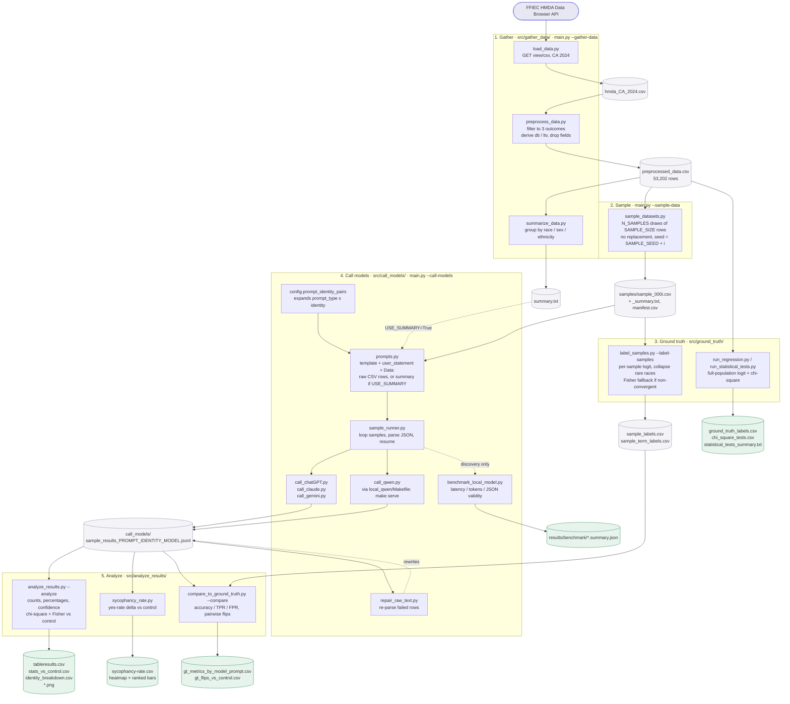

# Pipeline: HMDA API to printed results

Five stages. Each lives in one folder under `src/`, writes to one folder under `data/` or `results/`, and is runnable standalone or via `src/main.py`.



## Run order

```sh
cd src
python main.py --gather-data      # 1. API -> preprocessed_data.csv + summary.txt
python main.py --sample-data      # 2. -> data/gather_data/samples/
python main.py --label-samples    # 3. -> results/ground_truth/sample_labels.csv

cd call_models                    # 4. one call per (model x prompt x identity x sample)
python call_chatGPT.py            #    cloud
python call_claude.py
python call_gemini.py
cd ../local_qwen && make serve    #    local: terminal 1
cd ../call_models && python call_qwen.py   #      terminal 2

cd ../                            # 5.
python main.py --analyze          #    -> results/analyze_results/*.png + .csv
python main.py --compare          #    -> gt_metrics_*.csv, gt_flips_*.csv
```

## What controls the shape of a run

All in `src/config.py`:

| Knob | Effect |
|---|---|
| `N_SAMPLES`, `SAMPLE_SIZE`, `SAMPLE_SEED` | how many datasets, how many rows each, reproducibility |
| `USE_SUMMARY` | prompt embeds raw CSV rows (`False`, current) or the aggregate table (`True`) |
| `PROMPT_TYPES`, `IDENTITY_PROMPT_TYPES` | the 7 framings, and which 3 take a persona |
| `IDENTITIES`, `SELECTED_IDENTITIES` | the persona cross product (race x ethnicity x sex x age) |
| `GPT_/CLAUDE_/GEMINI_/QWEN_/LLAMA_/GEMMA_MODELS` | which models run |

Calls per model = `(non-identity prompts + identity prompts x identities) x N_SAMPLES`. The 8/31 run: `(4 + 3 x 16) x 3 = 156`.

## Notes

- **Resume is built in.** `sample_runner.completed_sample_ids()` reads the existing `.jsonl` and skips finished samples, so a crashed run restarts where it stopped.
- **Two ground-truth paths.** `label_samples.py` labels each *sample* (feeds `--compare`); `run_regression.py` / `run_statistical_tests.py` label the *full population* (standalone reporting). Only the first is wired into scoring.
- **Model discovery is filename-driven.** `analyze_results.py` and `compare_to_ground_truth.py` glob `sample_results_*.jsonl` rather than reading `config.py`, so they work on archived runs whose models are no longer in the config.
